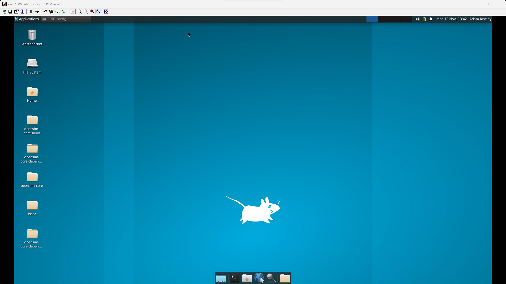

# 🖥️ `isaac.3me.tudelft.nl`

> A high-powered shared computer operated by the Biomechanical Engineering Department at TU Delft

## 📖 Table of Contents

- [Quickstart for existing users (Windows)](#quickstart)
- [Walkthrough for new users (Windows)](#walkthrough)
  1. [Connect to the server with SSH](#walkthrough-step-1)
  2. [Boot a VNC server on `isaac`](#walkthrough-step-2)
  3. [Setup a SSH tunnel to the VNC server](#walkthrough-step-3)
  4. [Install + setup VNC client on your machine](#walkthrough-step-4)
  5. [Use the client to connect to the VNC server via the tunnel](#walkthrough-step-5)
- [Hardware Details](#hardware-details)
- [OS Details](#os-details)
- [SSH Details](#ssh-details)
- [User Software Details](#user-software-details)
- [Other Notes](#other-notes)

## ⚡ Quickstart for existing users (Windows) <a name="quickstart"></a>

This assumes you already went through the [walkthrough](#walkthrough) below and
just want to reconnect:

- Open a terminal
- Run `ssh -L 59000:localhost:<your vnc port> username@isaac.3me.tudelft.nl`
- Type in your password (**remember, you can't see it being typed in**)
- Open your VNC client (VNC Connect, TightVNC Viewer, etc.) on your Windows machine
- Use your VNC password to connect

> ℹ️ **Note**
>
> - If you don't remember your user password, you'll have to ask an admin to reset it for you
> - If you don't remember your VNC port, you can restart your VNC server with `bme_vnc-restart`
> - If you don't remember your VNC password, you can reset it via your SSH session with `bme_vnc-passwd`


## 🚶 Walkthrough (Windows - you're a new user) <a name="walkthrough"></a>

This walkthrough sets up:

1. Using `ssh` to connect a terminal to `isaac`
2. Launching a personal VNC server on `isaac`
3. Opening an SSH tunnel to the VNC server
4. Setting up a VNC client on your computer
5. Using the VNC client to connect to your VNC server via the SSH tunnel

---
### 1. Connect to the server with SSH <a name="walkthrough-step-1"></a>

> ℹ️ **Note**: this assumes you already have SSH credentials
>
> - An isaac admin will give you a `username` + `password` combo. The combo differs from your TU Delft credentials
> - Once you have logged into `isaac.3me.tudelft.nl`, you can change your password in the terminal with `passwd`

All connections to `isaac.3me.tudelft.nl` must go via an SSH tunnel. SSH is a
standard method for creating a secure connection to a remote machine. By "SSHing"
into a server, you gain access to a remote terminal on `isaac` that you can use to
run things on it. You always need an SSH connection to connect to `isaac` - even
if you ultimately plan on using VNC to forward a remote GUI desktop. 

**To set up an SSH connection to `isaac.3me.tudelft.nl` on a Windows machine**:

- Open a Windows PowerShell window

  - SHIFT + right-click on your Windows desktop

  - Click "Open PowerShell Window Here"

- SSH into the server with your login credentials by typing `ssh
  YOUR_USERNAME@isaac.3me.tudelft.nl`

- Enter your password. **Note: you can't see anything being typed while typing
  your password in (it's a security feature)**

- You should now have an SSH connection to `isaac.3me.tudelft.nl`. It will print a
  welcome message, etc.

- If you only need  terminal access, you can stop reading this
  walkthrough - you're done :smile:

---
### 2. Boot a VNC server on `isaac` <a name="walkthrough-step-2"></a>

A VNC server is a piece of software that runs hosts a GUI desktop on
a machine (here, it'll be hosting a desktop *from* `isaac`). A VNC
client is a piece of software that connects to VNC servers and
presents the remote desktop to a user.

Each user on `isaac` hosts their own VNC server within their user account,
which means that you can reset it, keep it running overnight while your
laptop is turned off, change the password, etc.

**To set up a VNC server on `isaac`**:

- In your SSH session (established above) run `bme_vnc-start`. If
  necessary, type a new VNC password. You can change the password
  later with `bme_vnc-passwd`.

- The `bme_vnc-start` command should, before completing, print your
  VNC server's details. **You should note down**:

  - The VNC password you set
    - **this is different from your SSH password**
    - It is limited to 6 characters
    - It does not need to be secure, because your VNC connection
      always goes via your (secure) SSH connection
  - The VNC server's port, printed in the terminal (e.g. `6901`)
    - The `bme_vnc-start` should print this in a large banner, or some
      explanation text

After running `bme_vnc-start`, your VNC server should now be running on
running on `isaac`. Remember, though, that the only way to connect to it
is via an SSH tunnel (isaac's and TUD's firewalls only permit the SSH
connection), so we need to set up a tunnel.

---
### 3. Setup a SSH tunnel to the VNC server <a name="walkthrough-step-3"></a>

`isaac` only allows external connections via SSH. All services
(e.g. VNC) must connect via an SSH tunnel. This step sets up a tunnel
through the SSH connection through to the VNC server you booted in the
previous step.

**To setup an SSH tunnel for your VNC client on isaac**:

- (If your SSH session is still open in a terminal), exit your existing
  SSH connection to `isaac` by either:

  - Typing `exit` in the terminal (to `exit` the SSH session)
  - Pressing CTRL+D to interrupt+exit the terminal
  - Closing the Powershell window

- Open a new SSH session to `isaac` with tunelling enabled by running
  the command below (note: `<your VNC server port>` is printed during
  the previous step):

```bash
ssh -L 59000:localhost:<your VNC server port> YOUR_USERNAME@isaac.3me.tudelft.nl

# example: ssh -L 59000:localhost:6901 adam@isaac.3me.tudelft.nl
```

- Your terminal should now be connected via a new SSH session to `isaac`. It will
  look identical to your previous SSH session, but it now *also* tunnels that you
  make to `localhost:59000` on your machine to `<your VNC server port>` on `isaac`.

---
### 4. Install + setup VNC client on your machine <a name="walkthrough-step-4"></a>

To connect to the VNC server you booted on `isaac` in previous steps, you'll need a
VNC client. This walkthrough outlines using TightVNC which, while barebones-looking, is
functional and open-source.

> Note: Previous versions of this guide used VNC Connect. This guide is essentially the
> same as the previous versions, but was switched to TightVNC because of license concerns.

**To install a VNC client on your computer**:

- Download TightVNC from: https://www.tightvnc.com/download.php
- Install it
- Open it up, it should present a UI where you can enter a `Remote Host` etc.

---
### 5. Use the client to connect to the VNC server via the tunnel <a name="walkthrough-step-5"></a>

Once you have a VNC client, you need to boot it up and connect to `isaac` **via the ssh
tunnel**, so that you can then remotely control `isaac` via a remote desktop.

**To connect to your VNC server on `isaac` with the VNC client on your computer**:

- In your VNC client, connect to `localhost:59000`, which is the
  local-side of your (opened in the previous step) SSH tunnel to your
  VNC server (also a previous step) on `isaac`

- If you receive warnings about connection security (e.g. encyption)
  you can ignore these. The connection between the VNC client and
  `localhost:59000` is insecure, but local (to your machine). The
  actual data is transported via the (encrypted) SSH tunnel, which is
  secure - the VNC client doesn't "know" that's whats happening.

- Use your VNC password when connecting to the machine with the VNC
  client.

  - Note: you can change your password in the SSH session with
    `isaac_vnc-passwd`

  - Note #2: VNC passwords are usually max. 6 chars, so your usual
    password might've been truncated

- Once connected, you should see a (somewhat rough-looking) Linux
  desktop

---
### 6. Celebrate 🎉



If you see a remote desktop, you're done :smile:!


## 🤖 Hardware Details <a name="hardware-details"></a>

**tl;dr**: 2x64-core processors (256 threads), 256 GB memory, 2x RTX A5000 GPUs, 2 TB SSD, 8 TB HDD

| Interface | MAC Address | Physical Location |
| - | - | - |
| `enxb03af2b6059f` | `b0:3a:f2:b6:05:9f` | closest to PSU |
| `eno1np0` | `3c:ec:ef:ca:9b:70` | middle from PSU |
| `eno2np1` | `3c:ec:ef:ca:9b:71` | farthest from PSU |

```bash
# count physical processors
$ cat /proc/cpuinfo | grep 'physical id' | sort | uniq | wc -l
2
# print processor model name(s)
$ cat /proc/cpuinfo | grep 'model name' | sort | uniq
model name      : AMD EPYC 7713 64-Core Processor
# num threads
$ nproc
256
# total memory
$ cat /proc/meminfo | grep MemTotal
MemTotal:       263900564 kB
# show GPU information
$ nvidia-smi -L
GPU 0: NVIDIA RTX A5000 (UUID: GPU-56081830-3ba8-ab02-7439-1fa0f4452be5)
GPU 1: NVIDIA RTX A5000 (UUID: GPU-c9247f85-b247-45fa-edbc-1f794911a0b5)
# disk info (physical - note: LVM is being used here)
$ lsblk
sda                         8:0    1   7.3T  0 disk
sr0                        11:0    1  1024M  0 rom
nvme0n1                   259:0    0   1.8T  0 disk
├─nvme0n1p1               259:1    0     1G  0 part /boot/efi
├─nvme0n1p2               259:2    0     2G  0 part /boot
└─nvme0n1p3               259:3    0   1.8T  0 part
  └─ubuntu--vg-ubuntu--lv 253:0    0   100G  0 lvm  /var/snap/firefox/common/host-hunspell
```

## 🕹️ OS Details <a name="os-details"></a>

**tl;dr**: Ubuntu 22, installed with Logical Volume Management (LVM)

| Server Detail | Value | Comment |
| - | - | - |
| Short name | isaac | Used in any documentation etc. |
| `hostname` | isaac | Machines network-exposed name |
| Internet Domain Name | `isaac.3me.tudelft.nl` | Globally true |
| Firewall | SSH (TCP/22) only (+ICMP) | All connections must be tunneled via SSH |

## 🔒 SSH Details <a name="ssh-details"></a>

```bash
$ ssh-keyscan -t ecdsa isaac.3me.tudelft.nl > key.pub
$ ssh-keygen -l -f key.pub -E md5
256 MD5:13:da:5f:04:d8:1d:f3:25:a6:5b:50:66:67:56:38:58 isaac.3me.tudelft.nl (ECDSA)
$ ssh-keygen -l -f key.pub -E sha256
256 SHA256:mc5iQGpMA7KzS4gxa1VrYj5aKLvq7qBwOS+DnkxxzM0 isaac.3me.tudelft.nl (ECDSA)
```
| SSH ECDSA | isaac.3me.tudelft.nl ecdsa-sha2-nistp256 AAAAE2VjZHNhLXNoYTItbmlzdHAyNTYAAAAIbmlzdHAyNTYAAABBBEYIsORj6P8jGCvJFbQngiesjF0DGvtZunslHiRkTICdCsQQDLqsPORY/FcFNRyB04so1Mf1hVE5ZmlHYILnXzQ=

## 💾 User Software Details <a name="user-software-details"></a>

| Software Package | Installation Method | Notes |
| - | - | - |
| Firefox | apt | Primary Web Browser |
| OpenSim Creator | manual source build + install | Validates @adamkewley's purpose in life |
| Python3 | apt | `Python 3.11.5` |
| MATLAB | manual binary install | R2022b |
| Anaconda | manual binary install | Installed to `/opt/anaconda`. Added to `PATH` via `etc/profile` |
| Julia | apt | 1.8.5 |
| `opensim-core` | manual source build + install | `4.4.1`, installed in `/usr/local`, see `setup_scripts/opensim.sh` for build details |
| Blender | manual binary install | `3.4.1`` |
| SCONE | manual binary install | TODO |
| FEBio | manual binary install | TODO |
| Abaqus | manual binary install | TODO |
| Tensorflow | TODO | TODO |
| `gfortran` / `gcc` / `g++` | apt | `11.4.0` |


## F&Qs

## Q: How do I create my own Conda Environment?

A: You can either:

- **If you're using a remote GUI desktop via VNC**:
  - Open `anaconda-navigator` via a terminal
  - Click `Environments` on the left-side in Anaconda Navigator
  - Create a new environment
  - Ensure your new environment is activated
  - All applications booted via the navigator should then use your new environment

- **If you're using a terminal (e.g. via SSH)**:
  - Ensure you have initialized `conda` for your terminal: `conda init` (reopen your shell with `exit` etc.)
  - List available python versions with `conda search python`
  - Create it via (e.g.) `conda create --name your_envname  python=3.8.18`
  - Activate it via `conda activate your_envname`
  - Test it with (e.g.) `python --version` (should print `Python 3.8.18` if following the other example commands)


## Q: How do I setup OpenSim Python Scripting?

A: The easiest way to use the OpenSim API via Python is to use a conda
environment as they outline [here](https://simtk-confluence.stanford.edu:8443/display/OpenSim/Conda+Package). The
conda forge page for the package, where you can find more information, is [here](https://anaconda.org/opensim-org/opensim).

These steps must be performed in a terminal (Anaconda Navigator was being extremely
iffy about it):

```bash
# BEFORE STARTING, SEE: https://anaconda.org/opensim-org/opensim/files to figure
# out which versions of python are supported by opensim

# add conda-forge channel
conda config --remove channels conda-forge

# create relevant conda environment that can use OpenSim
conda create --channel conda-forge --name my_env_name python=3.11.5

# activate the environment
conda activate my_env_name

# install opensim into the environment
conda install -c opensim-org opensim

# test that it works (should print OpenSim's version to the console)
python -c "import opensim; print(opensim.__version__);"
```

You can then use `my_env_name` (or whatever you called it) in the terminal, or
activate it via Anaconda Navigator (the problems I encountered were only during
installation).


# 🗒️ Other Notes <a name="other-notes"></a>

## Logical Volume Management (LVM) Commands

LVM commands begin with prefixing `pv` for physical drive (volume), `vg` for volume group, and `lv` for logical volume within that group

```bash
# the OS+homedirs are currently on a volume group for the SSD
$ sudo vgdisplay
  --- Volume group ---
  VG Name               ubuntu-vg
  System ID
  Format                lvm2
  Metadata Areas        1
  Metadata Sequence No  5
  VG Access             read/write
  VG Status             resizable
  MAX LV                0
  Cur LV                2
  Open LV               1
  Max PV                0
  Cur PV                1
  Act PV                1
  VG Size               <1.82 TiB
  PE Size               4.00 MiB
  Total PE              476150
  Alloc PE / Size       476134 / <1.82 TiB
  Free  PE / Size       16 / 64.00 MiB
  VG UUID               H6iHHH-op2X-thyQ-19NJ-aDDd-tDwl-hPFKpj

  --- Volume group ---
  VG Name               vg0
  System ID
  Format                lvm2
  Metadata Areas        1
  Metadata Sequence No  1
  VG Access             read/write
  VG Status             resizable
  MAX LV                0
  Cur LV                0
  Open LV               0
  Max PV                0
  Cur PV                1
  Act PV                1
  VG Size               <7.28 TiB
  PE Size               4.00 MiB
  Total PE              1907721
  Alloc PE / Size       0 / 0
  Free  PE / Size       1907721 / <7.28 TiB
  VG UUID               SayMzO-67ou-P0fK-XGOp-dQxz-ZlQb-F3wQdW

# And those groups are sliced up into "OS" and "homedirs":
$ sudo lvdisplay
  --- Logical volume ---
  LV Path                /dev/ubuntu-vg/ubuntu-lv
  LV Name                ubuntu-lv
  VG Name                ubuntu-vg
  LV UUID                rTjqnp-j9tz-nVLh-kKJC-9TpN-4qig-9N2Mb6
  LV Write Access        read/write
  LV Creation host, time ubuntu-server, 2023-01-23 14:07:13 +0000
  LV Status              available
  # open                 1
  LV Size                100.00 GiB
  Current LE             25600
  Segments               1
  Allocation             inherit
  Read ahead sectors     auto
  - currently set to     256
  Block device           253:0

  --- Logical volume ---
  LV Path                /dev/ubuntu-vg/homedirs
  LV Name                homedirs
  VG Name                ubuntu-vg
  LV UUID                HCdDUH-0PZ8-CFTX-uBDR-vwWe-FcvS-eV9zT3
  LV Write Access        read/write
  LV Creation host, time isaac, 2023-06-29 12:18:03 +0000
  LV Status              available
  # open                 0
  LV Size                <1.72 TiB
  Current LE             450534
  Segments               1
  Allocation             inherit
  Read ahead sectors     auto
  - currently set to     256
  Block device           253:1
```
